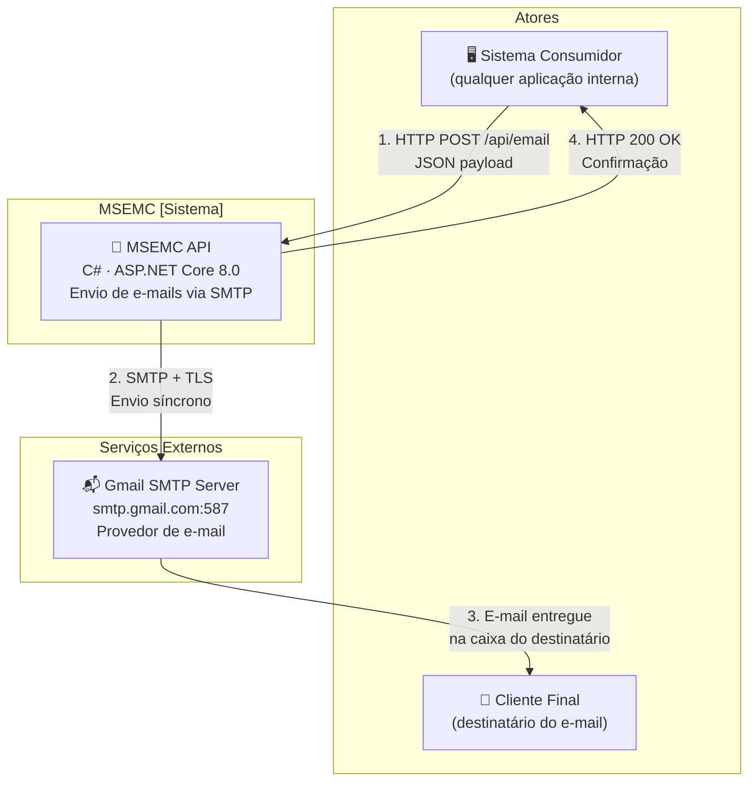
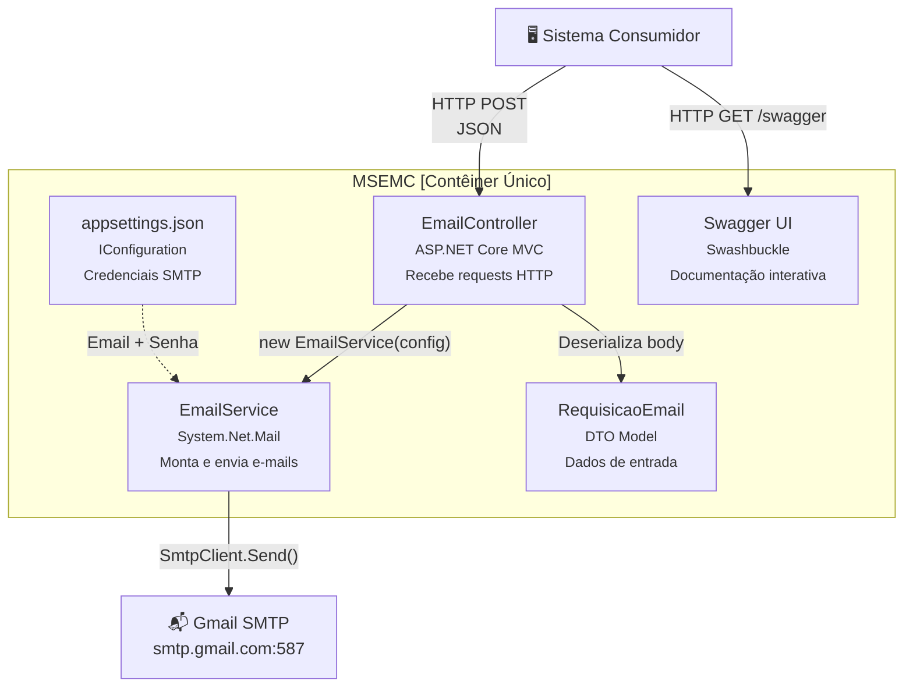
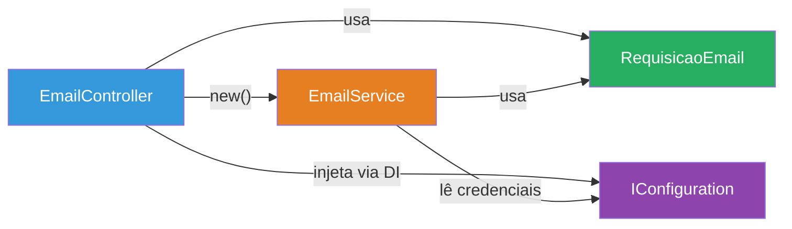
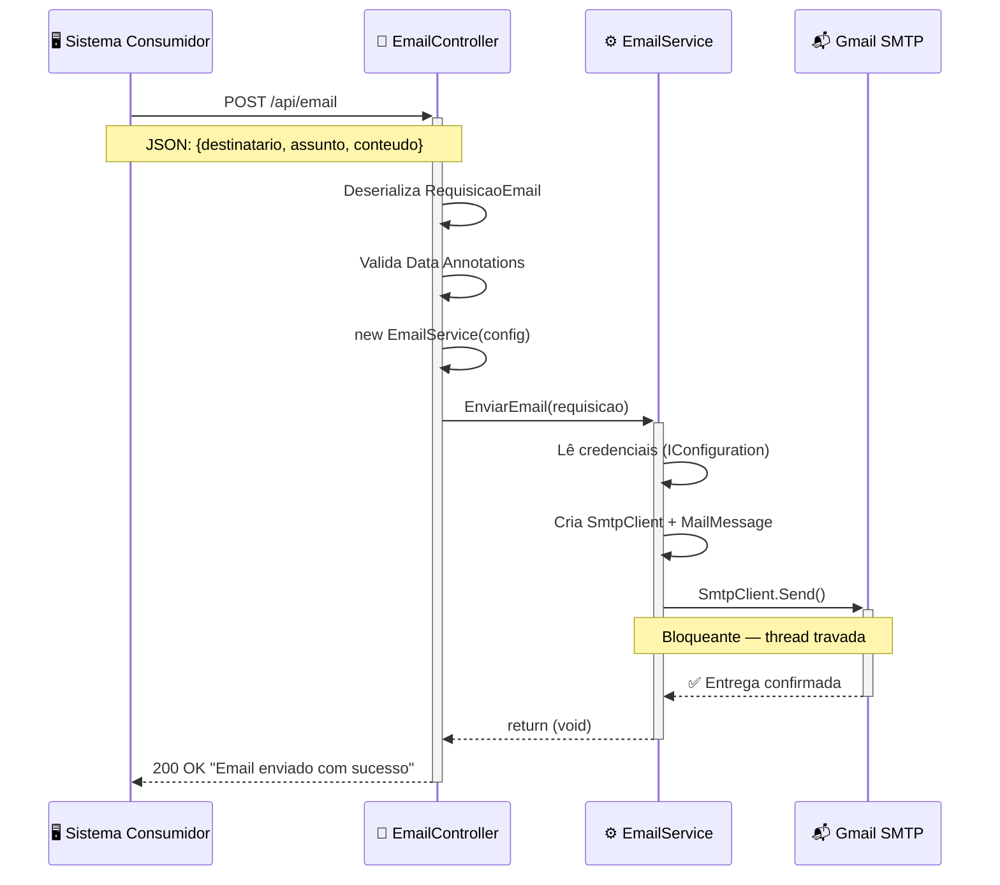
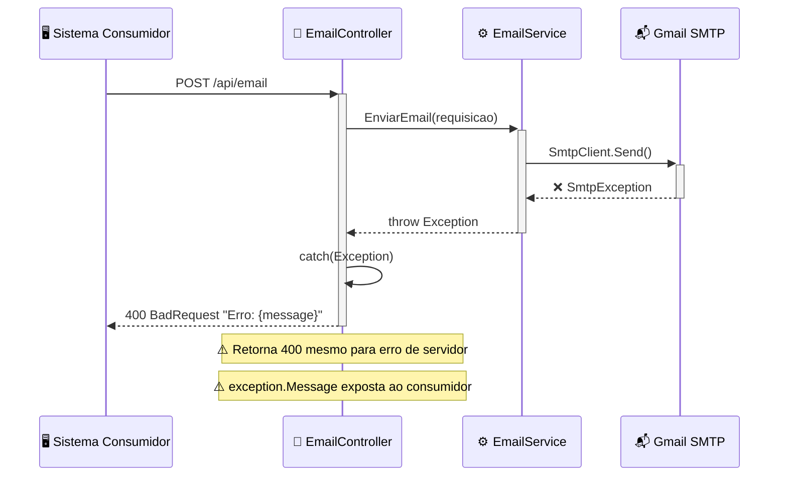
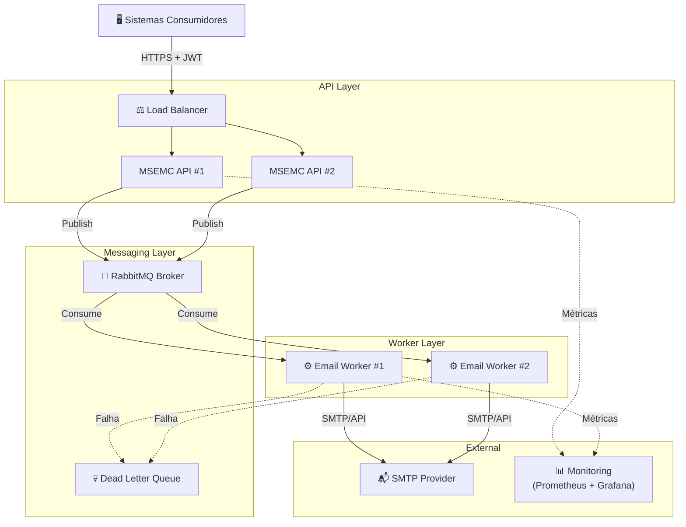

# 📐 Documentação de Arquitetura — MSEMC

> **Microserviço para Envio de Mensagens aos Clientes**
> Última atualização: 14/04/2026

---

## Sumário

- [1. Visão Geral](#1-visão-geral)
- [2. Estilo e Padrão Arquitetural](#2-estilo-e-padrão-arquitetural)
- [3. Diagrama de Contexto (C4 — Nível 1)](#3-diagrama-de-contexto-c4--nível-1)
- [4. Diagrama de Contêineres (C4 — Nível 2)](#4-diagrama-de-contêineres-c4--nível-2)
- [5. Componentes Principais (C4 — Nível 3)](#5-componentes-principais-c4--nível-3)
- [6. Decisões Arquiteturais (ADRs)](#6-decisões-arquiteturais-adrs)
- [7. Fluxos Críticos](#7-fluxos-críticos)
- [8. Stack Tecnológica](#8-stack-tecnológica)
- [9. Infraestrutura e Deploy](#9-infraestrutura-e-deploy)
- [10. Requisitos Não-Funcionais](#10-requisitos-não-funcionais)
- [11. Roadmap de Evolução Arquitetural](#11-roadmap-de-evolução-arquitetural)

---

## 1. Visão Geral

### Propósito

O **MSEMC** é uma API REST corporativa responsável pelo envio de e-mails via protocolo SMTP. Atua como um microserviço independente que pode ser integrado a qualquer sistema ou plataforma que necessite de comunicação por e-mail de forma confiável.

### Escopo

| Escopo | Descrição |
|--------|-----------|
| **Dentro do escopo** | Receber requisições HTTP, compor mensagens de e-mail, enviar via SMTP |
| **Fora do escopo** | Gestão de templates, tracking de abertura/cliques, gestão de contatos |

### Principais Stakeholders

| Stakeholder | Interesse |
|-------------|-----------|
| **Desenvolvedores** | Integram sistemas internos ao MSEMC via API REST |
| **Sistemas consumidores** | Aplicações que disparam requisições HTTP para envio de e-mails |
| **Clientes finais** | Destinatários dos e-mails enviados pelo serviço |
| **Equipe de operações** | Monitoramento, deploy e manutenção do serviço |

---

## 2. Estilo e Padrão Arquitetural

### Padrão Atual: Monolito Simples em Camadas

O projeto organiza-se em três camadas:

```
MSEMC/
├── Controllers/    → Camada de Apresentação (HTTP endpoints)
├── Services/       → Camada de Aplicação/Negócio (lógica de envio)
└── Models/         → Camada de Dados (DTOs de entrada)
```

### Características do Padrão

| Aspecto | Estado |
|---------|--------|
| Separação em camadas | ✅ Estrutura de diretórios presente |
| Inversão de dependência | ❌ Não implementada (instanciação com `new`) |
| Camada de domínio | ❌ Ausente — modelo é apenas DTO |
| Camada de infraestrutura | ❌ SMTP está embutido no Service |
| Comunicação entre camadas | Chamada direta, síncrona, fortemente acoplada |

### Trade-offs Reconhecidos

| ✅ Vantagem | ❌ Limitação |
|-------------|-------------|
| Extremamente simples de entender | Não escala horizontalmente |
| Poucas dependências | Impossível testar unitariamente |
| Rápido para desenvolver | Sem resiliência (envio síncrono bloqueante) |
| Baixa curva de aprendizado | Acoplamento forte dificulta evolução |

---

## 3. Diagrama de Contexto (C4 — Nível 1)

O diagrama de contexto mostra o MSEMC e suas relações com atores e sistemas externos.



### Descrição dos Fluxos

1. Um **sistema consumidor** envia uma requisição HTTP POST com dados do e-mail (destinatário, assunto, conteúdo HTML)
2. O **MSEMC** monta a mensagem e envia via **SMTP sobre TLS** para o Gmail
3. O **Gmail** entrega o e-mail ao **destinatário final**
4. O **MSEMC** retorna confirmação de envio ao sistema consumidor

> ⚠️ **Ponto de atenção:** Todo o fluxo é síncrono — o sistema consumidor fica bloqueado até o passo 4 completar.

---

## 4. Diagrama de Contêineres (C4 — Nível 2)

O MSEMC é composto por um único contêiner: a API Web.



### Protocolos de Comunicação

| Origem | Destino | Protocolo | Tipo | Observação |
|--------|---------|-----------|------|------------|
| Consumidor | EmailController | HTTP/HTTPS | Síncrono | REST, JSON body |
| EmailController | EmailService | In-process | Síncrono | `new` direto, sem DI |
| EmailService | Gmail SMTP | SMTP/TLS | Síncrono | Porta 587, `SmtpClient.Send()` |
| IConfiguration | EmailService | In-process | Leitura | Strings mágicas `"ConfiguracaoEmail:*"` |

---

## 5. Componentes Principais (C4 — Nível 3)

### 5.1 EmailController

**Arquivo:** `Controllers/EmailController.cs`

| Aspecto | Detalhe |
|---------|---------|
| **Rota** | `POST /api/email` |
| **Dependências** | `IConfiguration` (DI), `EmailService` (instanciação direta) |
| **Validação** | Data Annotations no model (`[Required]`, `[EmailAddress]`) |
| **Resposta sucesso** | `200 OK` — `"Email enviado com sucesso"` |
| **Resposta erro** | `400 BadRequest` — `"Erro: {exception.Message}"` |

**Responsabilidades:**
1. Receber e deserializar requisições HTTP
2. Instanciar o `EmailService` (acoplamento direto)
3. Delegar envio e-mail
4. Capturar exceções e retornar resposta

### 5.2 EmailService

**Arquivo:** `Services/EmailService.cs`

| Aspecto | Detalhe |
|---------|---------|
| **Função** | Montar mensagem e enviar via SMTP |
| **SMTP Host** | `smtp.gmail.com` (hardcoded) |
| **Porta** | `587` (hardcoded) |
| **Autenticação** | `NetworkCredential` com email/senha lidos de IConfiguration |
| **Envio** | Síncrono — `SmtpClient.Send()` |
| **HTML** | Suportado via `IsBodyHtml = true` |

**Responsabilidades:**
1. Ler credenciais SMTP da configuração
2. Criar e configurar `SmtpClient`
3. Montar `MailMessage` com dados da requisição
4. Enviar o e-mail

### 5.3 RequisicaoEmail

**Arquivo:** `Models/RequisicaoEmail.cs`

| Campo | Tipo | Validação | Utilizado |
|-------|------|-----------|-----------|
| `Destinatario` | `string` | `[Required]`, `[EmailAddress]` | ✅ Sim |
| `Assunto` | `string` | `[Required]` | ✅ Sim |
| `Conteudo` | `string` | `[Required]` | ✅ Sim |
| `Destinatarios` | `List<string>` | Nenhuma | ❌ Não |
| `Cc` | `List<string>?` | Nenhuma | ❌ Não |
| `Bcc` | `List<string>?` | Nenhuma | ❌ Não |
| `Attachments` | `List<Object>?` | Nenhuma | ❌ Não |

> Campos não utilizados são parte do roadmap (múltiplos destinatários, anexos).

### Diagrama de Dependências Internas



---

## 6. Decisões Arquiteturais (ADRs)

### ADR-001: Uso de `System.Net.Mail.SmtpClient`

| Item | Detalhe |
|------|---------|
| **Data** | Criação do projeto |
| **Status** | Aceita (pendente de revisão) |
| **Contexto** | Necessidade de enviar e-mails via SMTP com o mínimo de dependências externas |
| **Decisão** | Utilizar `System.Net.Mail.SmtpClient` da Base Class Library (BCL) do .NET |
| **Consequências (+)** | Zero dependências externas; funciona out-of-the-box; familiar para desenvolvedores .NET |
| **Consequências (-)** | Classe marcada como **obsoleta** pela Microsoft; não suporta OAuth2; `SendAsync` usa EAP (não TAP); bugs conhecidos sem correção; Microsoft recomenda MailKit como substituto |

### ADR-002: Instanciação Direta do Service no Controller

| Item | Detalhe |
|------|---------|
| **Data** | Criação do projeto |
| **Status** | Aceita (pendente de revisão) |
| **Contexto** | Controller precisa acessar a lógica de envio de e-mail |
| **Decisão** | Instanciar `EmailService` com `new` diretamente no construtor do controller |
| **Consequências (+)** | Máxima simplicidade; sem configuração de DI necessária |
| **Consequências (-)** | Viola Dependency Inversion Principle (DIP); impossibilita testes unitários; acoplamento forte; cada request cria nova instância |

### ADR-003: Configuração SMTP Hardcoded

| Item | Detalhe |
|------|---------|
| **Data** | Criação do projeto |
| **Status** | Aceita (pendente de revisão) |
| **Contexto** | Definição de host e porta do servidor SMTP |
| **Decisão** | Host (`smtp.gmail.com`) e porta (`587`) estão escritos diretamente no código-fonte |
| **Consequências (+)** | Funciona imediatamente para Gmail; sem configuração adicional |
| **Consequências (-)** | Impossibilita trocar de provedor sem alterar código-fonte; viola Open-Closed Principle; não funciona com outros provedores (SendGrid, SES, Outlook) |

### ADR-004: Envio Síncrono de E-mails

| Item | Detalhe |
|------|---------|
| **Data** | Criação do projeto |
| **Status** | Aceita (pendente de revisão) |
| **Contexto** | Padrão de execução do envio de e-mail |
| **Decisão** | Usar `SmtpClient.Send()` síncrono dentro do controller, bloqueando a thread da request |
| **Consequências (+)** | Simplicidade de implementação; resultado imediato para o consumidor |
| **Consequências (-)** | Bloqueia threads do ThreadPool sob carga; limita throughput; risco de ThreadPool starvation com poucas requests simultâneas |

### ADR-005: Pipeline CI/CD com GitHub Actions

| Item | Detalhe |
|------|---------|
| **Data** | Criação do projeto |
| **Status** | Aceita |
| **Contexto** | Automação do ciclo build-test-deploy |
| **Decisão** | Usar GitHub Actions com workflow único para build, test, security scan e publish |
| **Consequências (+)** | Integrado ao GitHub; gratuito para repositórios públicos; workflow declarativo |
| **Consequências (-)** | Deploy está simulado (`echo`); sem ambientes separados; security scan não bloqueia pipeline (`|| true`) |

---

## 7. Fluxos Críticos

### 7.1 Envio de E-mail — Happy Path



### 7.2 Fluxo de Erro — Falha no SMTP



### 7.3 Fluxo de Recuperação

> **Não implementado.** Atualmente não há mecanismo de:
> - Retry automático em caso de falha temporária
> - Circuit breaker para proteger o servidor SMTP
> - Dead Letter Queue para e-mails que falharam
> - Logging de erros para investigação

---

## 8. Stack Tecnológica

### Dependências Atuais

| Camada | Tecnologia | Versão | Função |
|--------|-----------|--------|--------|
| **Runtime** | .NET | 8.0 | Plataforma de execução |
| **Framework** | ASP.NET Core Web API | 8.0 | Framework HTTP/REST |
| **Documentação** | Swashbuckle.AspNetCore | 6.6.2 | Swagger / OpenAPI |
| **Email** | System.Net.Mail | BCL | Envio SMTP (obsoleto) |
| **CI/CD** | GitHub Actions | v4 | Pipeline de build e deploy |
| **VCS** | Git + GitHub | — | Controle de versão |

### Estrutura do Projeto

```
MSEMC/
├── .github/
│   └── workflows/
│       └── deploy.yml              # Pipeline CI/CD
├── Controllers/
│   └── EmailController.cs          # Endpoint POST /api/email
├── Models/
│   └── RequisicaoEmail.cs          # DTO de entrada
├── Services/
│   └── EmailService.cs             # Lógica de envio SMTP
├── Properties/
│   └── launchSettings.json         # Perfis de execução local
├── .gitignore                      # Exclusões do Git
├── appsettings.Development.json    # Config de desenvolvimento
├── MSEMC.csproj                    # Arquivo de projeto .NET
├── MSEMC.sln                       # Solution file
├── MSEMC.http                      # Arquivo de testes HTTP
├── Program.cs                      # Entry point da aplicação
├── README.md                       # Documentação do projeto
└── ARCHITECTURE.md                 # Este documento
```

---

## 9. Infraestrutura e Deploy

### Ambientes

| Ambiente | Status | Localização |
|----------|--------|-------------|
| **Development** | ✅ Configurado | Local via `dotnet run` (porta 5116 HTTP / 7018 HTTPS) |
| **Staging** | ❌ Não existe | — |
| **Production** | ❌ Não existe | — |

### Pipeline CI/CD

O projeto utiliza **GitHub Actions** com um workflow único que roda em push para `master`:

```
Checkout → Security Audit → Setup .NET 8 → Restore → Build → Test → Analysis → Publish → Deploy (simulado)
```

| Etapa | Implementação | Status |
|-------|---------------|--------|
| Checkout do código | `actions/checkout@v4` | ✅ |
| Scan de vulnerabilidades | `dotnet list package --vulnerable` | ⚠️ Falhas são ignoradas (`\|\| true`) |
| Setup .NET | `actions/setup-dotnet@v4` (.NET 8.0.x) | ✅ |
| Restore de dependências | `dotnet restore` | ✅ |
| Build Release | `dotnet build --no-restore --configuration Release` | ✅ |
| Testes automatizados | `dotnet test` | ⚠️ Nenhum projeto de teste existe |
| Análise de código | `dotnet build /p:EnableNETAnalyzers=true` | ✅ |
| Publish | `dotnet publish -c Release -o out` | ✅ |
| Deploy | `echo "simulado"` | ❌ Nenhum deploy real |

### Gestão de Secrets

| Secret | Mecanismo | Uso |
|--------|-----------|-----|
| `EmailSettings__Email` | GitHub Secrets → Env Var | Credencial do remetente |
| `EmailSettings__Password` | GitHub Secrets → Env Var | Senha/App Password do remetente |

### Estratégia de Deploy

> Não há estratégia de deploy definida. O pipeline termina com um `echo` simulado. Não há rollback, blue-green, canary, nem qualquer mecanismo de deploy automatizado.

---

## 10. Requisitos Não-Funcionais

### Status de Atendimento

| Requisito | Status | Detalhes |
|-----------|--------|----------|
| **Disponibilidade** | ❌ | Sem health checks; sem redundância; SPOF no SmtpClient |
| **Latência** | ⚠️ | Dependente do tempo de resposta do Gmail (1-5s por e-mail) |
| **Throughput** | ❌ | Limitado a threads disponíveis no ThreadPool (envio síncrono) |
| **Escalabilidade horizontal** | ❌ | Sem containerização; sem fila de mensagens; sem stateless design |
| **Segurança** | ⚠️ | SMTP via TLS; credenciais em GitHub Secrets; mas API aberta sem autenticação |
| **Observabilidade** | ❌ | Sem logging estruturado; sem métricas; sem alertas |
| **Testabilidade** | ❌ | Sem interfaces; sem testes; acoplamento forte |
| **Compliance (LGPD/GDPR)** | ❌ | Sem controle de opt-in/opt-out; sem auditoria de envios |

### Limites Conhecidos

| Recurso | Limite | Fonte |
|---------|--------|-------|
| Gmail SMTP (contas gratuitas) | 500 e-mails/dia | Google |
| Gmail SMTP (Google Workspace) | 2.000 e-mails/dia | Google |
| Tamanho do e-mail (Gmail) | 25 MB incluindo anexos | Google |
| Threads ASP.NET Core ThreadPool | ~1.000 (padrão) | .NET Runtime |

---

## 11. Roadmap de Evolução Arquitetural

### Fase 1 — Fundação (Prioridade Crítica)

> Corrigir problemas estruturais que bloqueiam qualquer evolução.

| # | Melhoria | Complexidade |
|---|----------|-------------|
| 1 | Introduzir interfaces + Injeção de Dependência | Baixa |
| 2 | Corrigir vazamento de recursos (IDisposable) | Baixa |
| 3 | Externalizar config SMTP (Options Pattern) | Baixa |
| 4 | Adotar async/await em toda a cadeia | Baixa |

### Fase 2 — Robustez (Prioridade Alta)

> Preparar o serviço para ambiente de produção.

| # | Melhoria | Complexidade |
|---|----------|-------------|
| 5 | Substituir SmtpClient por MailKit | Média |
| 6 | Implementar tratamento de erros + Problem Details (RFC 7807) | Média |
| 7 | Adicionar logging estruturado (Serilog) | Baixa |

### Fase 3 — Escalabilidade (Prioridade Alta)

> Habilitar crescimento e proteção contra abuso.

| # | Melhoria | Complexidade |
|---|----------|-------------|
| 8 | Autenticação (API Key / JWT) + Rate Limiting | Média |
| 9 | Containerização (Docker + docker-compose) | Baixa |
| 10 | Fila de mensagens (RabbitMQ + MassTransit) + Worker Service | Alta |

### Fase 4 — Maturidade (Prioridade Média)

> Consolidar operação e habilitar crescimento contínuo.

| # | Melhoria | Complexidade |
|---|----------|-------------|
| 11 | Health Checks + Métricas (OpenTelemetry) | Baixa |
| 12 | Projeto de testes automatizados (xUnit + WebApplicationFactory) | Média |

### Arquitetura-Alvo



---

> **📌 Este documento deve ser atualizado a cada mudança arquitetural significativa.**
> Para detalhes sobre melhorias com motivação técnica e ganho de valor, consulte o relatório de análise arquitetural.
